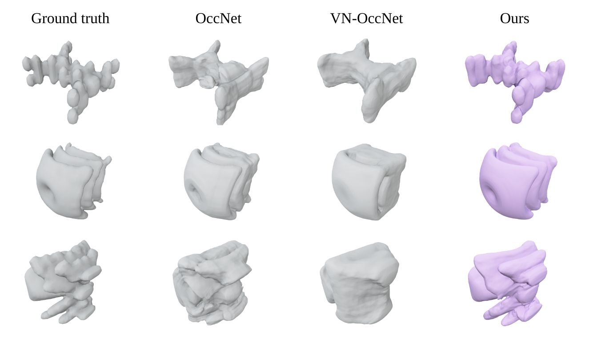

# FER-multifrequency-so3

Created by Dongwon Son, Jaehyung Kim, Sanghyeon Son, and Beomjoon Kim.

The usage of 3D vision algorithms, such as shape reconstruction, remains limited because they require inputs to be at a fixed canonical rotation. Recently, a simple equivariant network, Vector Neuron (VN) (Deng et al., 2021) has been proposed that can be easily used with the state-of-the-art 3D neural network (NN) architectures. However, its performance is limited because it is designed to use only three-dimensional features, which is insufficient to capture the details present in 3D data. In this paper, we introduce an equivariant feature representation for mapping a 3D point to a high-dimensional feature space. Our feature can discern multiple frequencies present in 3D data, which, as shown by Tancik et al. (2020), is the key to designing an expressive feature for 3D vision tasks. Our representation can be used as an input to VNs, and the results demonstrate that with our feature representation, VN captures more details, overcoming the limitation raised in its original paper.

[Project](https://sites.google.com/view/fer-multifrequency-so3/) [Paper](https://openreview.net/forum?id=5JWAOLBxwp)



## Setup environment

For classification, part segmentation, and occupancy networks, please set up a conda environment using...
```bash
conda env create --file environment.yaml
```

For GraphONet please refer to the directory. Please check out each directory for further instructions.
